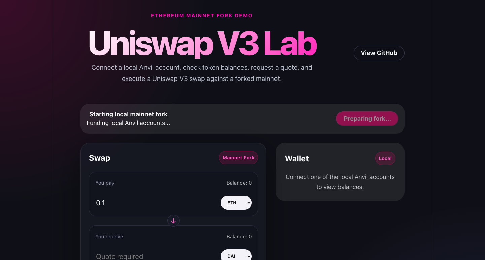
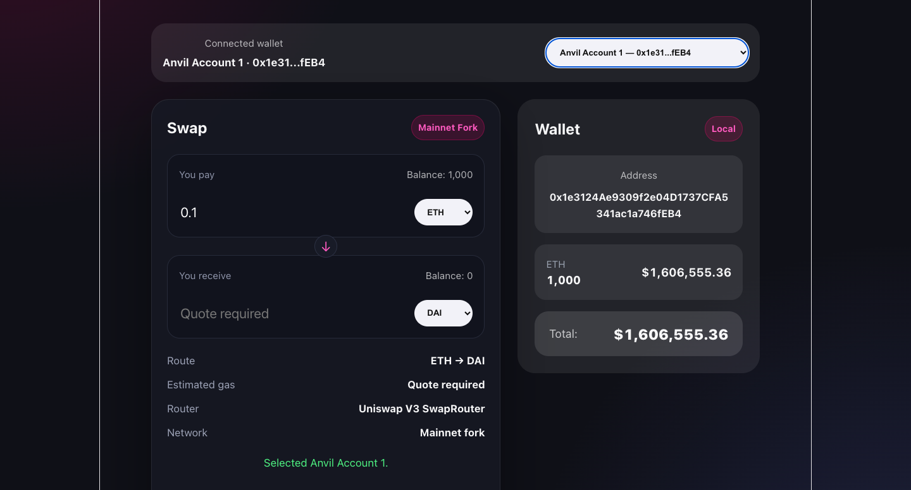
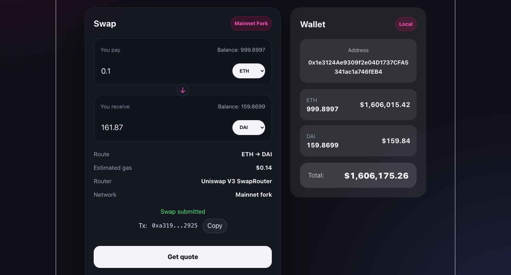

# Uniswap V3 Lab

A mainnet-fork Ethereum project for experimenting with Uniswap V3 integrations using Solidity, Foundry, Hardhat, TypeScript, Express, React, and Anvil.

The project started as a simple WETH → DAI swap demo and has been expanded into a local Uniswap V3 fork lab with:

* Solidity helper contracts for executing swaps on a forked Ethereum mainnet.
* TypeScript quote and swap clients.
* A backend API for managing fork sessions, quotes, swaps, wallet summaries, and local accounts.
* A React frontend for interacting with local fork wallets and executing demo swaps.
* Per-session Anvil fork management with port allocation, process tracking, session files, and expiry cleanup.
* Nginx-ready production deployment layout for serving the frontend and proxying API requests.

This project is for local fork/demo purposes only. It is not intended for production mainnet trading.

---

## Demo

Live demo: [www.rizofan88.com](https://rizofan88.com)

> The hosted demo runs against forked Ethereum mainnet state. It does not execute real mainnet swaps.

## Screenshots

### Landing Page 



### Wallet Connected



### Quote and swap result



---

## What this includes

* Solidity contract integration with Uniswap V3 `SwapRouter`.
* Mainnet-fork testing with Foundry and Anvil.
* TypeScript scripting with ethers v6.
* Uniswap quote API integration for exact-input swap estimates.
* WETH wrapping, ERC20 approvals, and swap execution.
* Express API design for blockchain operations.
* React frontend integration with a local fork backend.
* Per-session fork isolation using Anvil processes.
* Local wallet/account selection from fork-funded accounts.
* Wallet balance aggregation and USD value display.
* Session lifecycle management using state files.
* Port allocation and cleanup for multiple local fork sessions.
* Nginx reverse proxy deployment for frontend/API separation.
* Clean separation of addresses, ABIs, token metadata, swap logic, quote logic, API handlers, validation, and state management.

---

## Current features

### Smart contract / fork features

* Mainnet fork execution through Anvil.
* Foundry tests against forked mainnet state.
* WETH wrapping support.
* ERC20 approval flow.
* Exact-input Uniswap V3 swaps.
* Local funded accounts for testing.
* Deployed local swap helper contract reused by the session backend.

### Quote features

* Quote requests through the Uniswap Quote API.
* Exact-input quotes.
* Token symbol resolution from the local token list.
* Estimated output amount.
* Estimated gas fee in USD.

### Backend API features

* Initialize a local fork session.
* Ping/refresh an existing session.
* Fetch supported token symbols.
* Fetch available local fork accounts.
* Fetch wallet balances and estimated USD values.
* Fetch swap quotes.
* Execute swaps through the local fork.
* Validate request bodies and query parameters.
* Return frontend-readable error messages.
* Track session state, Anvil process data, deployed contracts, and assigned ports.

### Frontend features

* React/Vite browser UI.
* Automatic session creation using `sessionStorage`.
* Fork initialization status.
* Local wallet connection from funded Anvil accounts.
* Wallet balance panel.
* Token selection.
* Quote fetching.
* Swap execution.
* Transaction hash display.
* Copy transaction hash UI.
* Separate frontend error states for fatal errors, wallet errors, quote errors, and swap errors.
* Production build served from `frontend/dist`.

---

## Tech stack

### Smart contracts and local fork

* Solidity
* Foundry
* Forge
* Anvil
* Hardhat
* Uniswap V3 periphery

### Backend and scripts

* TypeScript
* Node.js
* Express
* ethers v6
* Uniswap Quote API
* child process management for Anvil
* filesystem-based session state

### Frontend

* React
* Vite
* TypeScript
* CSS
* Browser `sessionStorage`

### Deployment

* Ubuntu server
* Nginx
* PM2
* UFW
* Optional Certbot/HTTPS setup

---

## Project structure

```text
contracts/   Solidity swap helper contracts
src/         Core TypeScript quote, swap, token, provider, and signer logic
server/      Express API handlers, validation, and errors
state/       Session, Anvil process, expiry, and port management
frontend/    React/Vite frontend
shared/      Shared frontend/backend types
docs/        Architecture documentation
scripts/     CLI quote and swap scripts
test/        Foundry tests
```


## High-level architecture

```text
React frontend
  ↓
Express API
  ↓
Session manager
  ↓
Per-session Anvil mainnet fork
  ↓
Funded local account + deployed swap helper contract
  ↓
Uniswap V3 SwapRouter on forked mainnet
```

The frontend does not talk directly to Ethereum. It talks to the local API.

The API owns the fork lifecycle, account access, quotes, swaps, and session state.

Each browser session receives or creates a `sessionId`. That `sessionId` is used by the backend to map the user to a specific Anvil fork process and port.

For a deeper explanation of the session lifecycle, Anvil process management, port allocation, request flow, and swap execution internals, see [`docs/architecture.md`](docs/architecture.md).

---

## Security note

Do not expose `.env`, `.env.accounts`, Anvil RPC ports, or backend internals publicly.

The demo backend signs transactions using local fork accounts. This is acceptable for a controlled fork demo, but it is not a production wallet architecture.

---

## Setup

Install root dependencies:

```bash
npm install
```

Install frontend dependencies:

```bash
cd frontend
npm install
cd ..
```

Install Foundry if you do not already have it:

```bash
curl -L https://foundry.paradigm.xyz | bash
foundryup
```

Add Forge test utilities:

```bash
mkdir -p lib/
git clone https://github.com/foundry-rs/forge-std lib/forge-std
```

Create a `.env` file:

```bash
cp .env.example .env
```

Add a valid Ethereum mainnet RPC URL and Uniswap API key:

```env
MAINNET_RPC_URL_ALCHEMY=https://eth-mainnet.g.alchemy.com/v2/YOUR_API_KEY
UNISWAP_API_KEY="YOUR_UNISWAP_API_KEY"
```

This implementation also uses predefined accounts that you can find inside `.env.accounts`. You may add other accounts conforming to this format:

```env
ADDRESS0=0x...
KEY0=0x...
ADDRESS1=0x...
KEY1=0x...
```

Then load the environment:

```bash
source .env
source .env.accounts
```

---

## Run local mainnet fork manually

Foundry RPC aliases are configured in `foundry.toml`:

```toml
[rpc_endpoints]
mainnet_chainnodes = "${MAINNET_RPC_URL_CHAINNODES}"
mainnet_alchemy = "${MAINNET_RPC_URL_ALCHEMY}"
localhost = "http://127.0.0.1:8545"
```

The npm scripts use the `mainnet_alchemy` alias, so `.env` must define the same variable name used in `foundry.toml`.

If you rename `MAINNET_RPC_URL_ALCHEMY`, update `foundry.toml` as well.

Start a local fork:

```bash
npm run fork
```

This runs a command similar to:

```bash
anvil --fork-url mainnet_alchemy \
  --fork-block-number -10 \
  --fork-chain-id 1 \
  --chain-id 1
```

The manual fork starts at:

```text
http://127.0.0.1:8545
```

Keep this terminal running while executing tests or TypeScript scripts from another terminal.

The Express session system can also spawn Anvil automatically, so this manual fork is mainly useful for direct testing and script execution.

---

## Run Forge tests

In a second terminal:

```bash
npm run test:forge
```

This runs:

```bash
forge test --fork-url localhost -vvv
```

---

## Run TypeScript swap script

```bash
npm run swap:local
```

This runs:

```bash
npx hardhat run scripts/swap.ts --network localhost
```

---

## Query Uniswap quote API from CLI

```bash
npm run quote -- <tokenIn> <tokenOut> <amount>
```

Example:

```bash
npm run quote -- WETH DAI 0.1
```

The quote command resolves token symbols from the local token list in:

```text
src/tokens/tokens.ts
```

Only tokens defined in that file are supported by the CLI.

To add another token, add a new `Token` definition to `src/tokens/tokens.ts` and include it in `TOKEN_LIST`.

---

## Some useful scripts for testing

```bash
npm run dev:test-dep -- localhost
```

Sends a `cast` transaction to the running local anvil fork to wrap `ETH` into `WETH`.

```bash
npm run dev:test-bal -- localhost
```

Sends a `cast` call to the running local anvil fork to query the `WETH` balance of one of the default fork accounts.

You can also add different aliases in `foundry.toml` to test it with different forks or rpc endpoints other than `localhost`.

---

## Run the backend API locally

Start the Express API from the project root.

The exact script name depends on `package.json`, but the command is expected to be similar to:

```bash
npm run api
```

or:

```bash
npx tsx server/api.ts
```

The API listens on:

```text
http://localhost:3001
```

The frontend development server proxies `/api` requests to this backend through `frontend/vite.config.ts`.

---

## Run the frontend locally

```bash
cd frontend
npm run dev
```

The Vite dev server usually runs at:

```text
http://localhost:5173
```

During local development, API requests are proxied from:

```text
http://localhost:5173/api/...
```

to:

```text
http://localhost:3001/api/...
```

---

## Build the frontend

```bash
cd frontend
npm run build
```

The build artifact is generated in:

```text
frontend/dist
```

This directory can be served by Nginx in production.

---

## Production deployment model

The production deployment is designed around:

```text
Browser
  ↓
Nginx
  ├── serves frontend/dist
  └── proxies /api/ to Express on localhost:3001
          ↓
        Express API
          ↓
        Anvil fork processes
```

Example Nginx layout:

```nginx
server {
    listen 80;
    server_name YOUR_DOMAIN_OR_SERVER_IP;

    root /var/www/uniswap-frontend;
    index index.html;

    location ~* \.(env|ini|log|conf|bak|sql|sqlite|db)$ {
        return 404;
    }

    location ~ /\.(?!well-known) {
        return 404;
    }

    location / {
        try_files $uri $uri/ /index.html;
    }

    location /api/ {
        proxy_pass http://127.0.0.1:3001/api/;
        proxy_http_version 1.1;

        proxy_set_header Host $host;
        proxy_set_header X-Real-IP $remote_addr;
        proxy_set_header X-Forwarded-For $proxy_add_x_forwarded_for;
        proxy_set_header X-Forwarded-Proto $scheme;
    }
}
```

The backend should remain bound to localhost:

```text
127.0.0.1:3001
```

Only Nginx should expose it publicly through `/api/`.

---

## PM2 deployment

On the server, the backend can be kept alive with PM2.

Example:

```bash
pm2 start npm --name uni -- run api
```

Check process status:

```bash
pm2 status
```

Inspect logs:

```bash
pm2 logs uni
```

Save the PM2 process list:

```bash
pm2 save
```

Enable PM2 startup on reboot:

```bash
pm2 startup
```

Then run the command printed by PM2.

---

## Firewall notes

A typical UFW setup exposes only SSH and HTTP/HTTPS:

```bash
sudo ufw allow 22
sudo ufw allow 80
sudo ufw allow 443
sudo ufw enable
```

The Express API port should not need to be public if Nginx proxies requests internally.

Anvil ports should also stay local.

---

## HTTPS notes

For a domain-based deployment, HTTPS can be added with Certbot.

Typical flow:

```bash
sudo apt install certbot python3-certbot-nginx
sudo certbot --nginx
```

This requires a real domain pointing to the server IP.

If accessing the site directly through an IP address, browsers will usually show it as not secure because normal public TLS certificates are issued for domain names, not raw IP addresses.

---

## Example outputs

### Forge test output

```bash
forge test --fork-url localhost -vvv
```

```text
[⠊] Compiling...
[⠒] Compiling 26 files with Solc 0.8.30
[⠑] Solc 0.8.30 finished in 2.58s
Compiler run successful!

Ran 7 tests for test/WethToDaiSwap.t.sol:WethToDaiSwapTest
[PASS] testDeploys() (gas: 2484)
[PASS] testSwapConsumesExactWethAmount() (gas: 169808)
[PASS] testSwapOutputsDai() (gas: 169748)
[PASS] testSwapRevertsWithoutApproval() (gas: 50744)
[PASS] testUserCanApproveSwapContract() (gas: 68695)
[PASS] testUserCanSwapWETHForDAI() (gas: 172148)
[PASS] testUserCanWrapEthIntoWeth() (gas: 42221)
Suite result: ok. 7 passed; 0 failed; 0 skipped; finished in 15.56ms (8.04ms CPU time)

Ran 1 test suite in 701.03ms (15.56ms CPU time): 7 tests passed, 0 failed, 0 skipped (7 total tests)
```

### Swap script output

```bash
npx hardhat run scripts/swap.ts --network localhost
```

```text
--- Wrapping ETH into WETH ---

--- Balances before swap ---
WETH: 0.1
DAI: 204.001788267463093592

--- Deploying WethToDaiSwap contract ---

--- WethToDaiSwap deployed at address ---
0xa68E430060f74F9821D2dC9A9E2CE3aF7d842EBe

--- Approving WethToDaiSwap contract ---
Allowance: 0.1 WETH

--- Executing swap ---

--- Balances after swap ---
DAI: 408.002728227362767699
WETH: 0.0

--- Swap result ---
DAI received: 204.000939959899674107
WETH spent: 0.1
```

### Quote script output

```bash
npx tsx scripts/quote.ts WETH DAI 0.1
```

```text
--- Quote ---
Input:      0.1  WETH
Output:  210.09  DAI
Fees:     $0.01  
-------------
```

---

## Notes and limitations

This project is for local fork/demo purposes only.

It does not implement production-grade swap safety.

Important limitations:

* The frontend only interacts with local fork accounts, not a real browser wallet.
* The backend controls signing through local Anvil/private-key signers.
* The app executes swaps on a fork, not on real Ethereum mainnet.
* Runtime session files and port state are local server state.
* Stale Anvil processes should be cleaned up by the session health/expiry logic.
* Slippage handling is simplified for demo purposes.
* Quotes come from the quote API, while swaps execute against the local fork state, so output can differ if fork state or quote assumptions differ.
* This should not be used as-is for real mainnet swaps.

For real mainnet swaps, the app would need:

* real wallet integration;
* transaction construction for user signing;
* proper slippage calculation;
* deadline management;
* quote freshness checks;
* production-grade error handling;
* transaction simulation;
* chain/account validation;
* security review;
* rate limiting and abuse protection.
